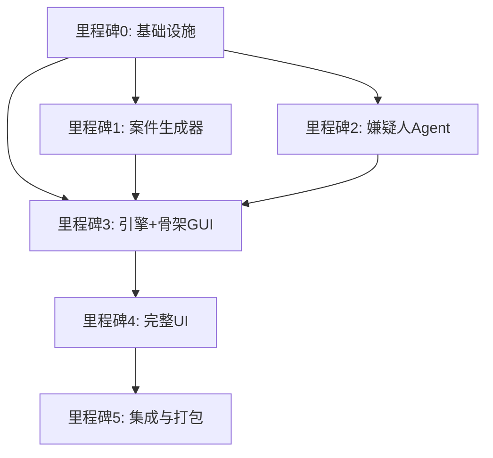

好的，我将为你生成所有补充文件的具体内容和存储位置。这些文件将放在项目根目录下的相应文件夹中，AI Agent 可以直接使用。

---

## 项目最终完整结构（新增部分高亮）

```
the_box_local/
├── .github/
│   └── workflows/
│       └── ci.yml                     # CI 工作流
├── core/
│   ├── __init__.py
│   ├── exceptions.py
│   ├── case_generator.py
│   ├── suspect_agent.py
│   ├── interrogation.py
│   ├── db.py
│   ├── config.py
│   ├── logger.py                      # 统一日志
│   └── llm_client.py                  # 封装 OpenAI 调用
├── ui/ ...（原有）
├── assets/ ...
├── schemas/                           # 新增：接口契约
│   ├── __init__.py
│   ├── interface_definitions.py
│   ├── events.py
│   └── validation_schema.json
├── docs/                              # 新增：文档
│   ├── ERROR_HANDLING.md
│   ├── DEVELOPMENT_PLAN.md
│   ├── USER_STORIES.md
│   └── TEMPLATE_MODULE.md
├── scripts/
│   ├── validate_case.py               # 原有
│   └── quality_metrics.py             # 新增：质量评分
├── tests/
│   ├── fixtures/                      # 新增：Mock 数据
│   │   ├── mock_cases/
│   │   │   ├── simple.json
│   │   │   └── full.json
│   │   ├── mock_suspect_responses.json
│   │   └── conftest.py                # 全局 fixtures
│   └── ...（原有测试）
├── .flake8
├── .isort.cfg
├── .pre-commit-config.yaml
├── pyproject.toml
├── requirements.txt
├── main.py
└── README.md
```

---

## 1. 接口契约与数据结构定义

### `schemas/interface_definitions.py`

```python
"""跨模块接口的类型定义，用于静态检查提示。"""

from typing import Protocol, Dict, List, Optional, TypedDict

# ---------- 嫌疑人 Agent 协议 ----------
class SuspectAgentProtocol(Protocol):
    name: str
    pressure: int
    memory: List[Dict[str, str]]

    def respond(self, player_input: str, context: Optional[Dict] = None) -> Dict:
        """
        返回格式必须为：
        {
            "reply": str,
            "pressure_change": int,
            "secret_triggered": Optional[str]
        }
        """
        ...

# ---------- 案件数据结构 ----------
class SuspectData(TypedDict):
    name: str
    role: str
    personality: str
    knowledge: str
    forbidden_to_reveal: List[str]

class EvidenceData(TypedDict):
    id: str
    name: str
    description: str
    related_suspect: Optional[str]

class CaseDict(TypedDict):
    case_id: str
    title: str
    victim: str
    cause_of_death: str
    crime_scene: str
    truth: str
    suspects: List[SuspectData]
    evidences: List[EvidenceData]
    interrogation_time_limit_sec: int

# ---------- 审讯引擎状态 ----------
class EngineStateDict(TypedDict):
    current_suspect_index: int
    presented_evidence_ids: List[str]
    time_left: int
    state: str  # "selecting", "interrogating", "breakdown", "verdict"
    suspects_states: List[Dict]  # 每个嫌疑人的序列化状态
```

### `schemas/events.py`

```python
"""引擎与 UI 之间的事件通信格式。"""

from typing import Literal, Union, Optional
from typing_extensions import TypedDict

class NewMessageEvent(TypedDict):
    type: Literal["new_message"]
    role: Literal["player", "suspect", "system"]
    content: str
    suspect_name: Optional[str]

class SuspectUpdateEvent(TypedDict):
    type: Literal["suspect_update"]
    suspect_index: int
    pressure: int
    secret_triggered: Optional[str]

class StateChangeEvent(TypedDict):
    type: Literal["state_change"]
    new_state: str  # "selecting", "interrogating", "breakdown", "verdict"
    verdict_reason: Optional[str]

class TimerTickEvent(TypedDict):
    type: Literal["timer_tick"]
    time_left: int

UIEvent = Union[NewMessageEvent, SuspectUpdateEvent, StateChangeEvent, TimerTickEvent]
```

### `schemas/validation_schema.json`

```json
{
  "$schema": "http://json-schema.org/draft-07/schema#",
  "type": "object",
  "properties": {
    "case_id": {"type": "string"},
    "title": {"type": "string"},
    "victim": {"type": "string"},
    "cause_of_death": {"type": "string"},
    "crime_scene": {"type": "string"},
    "truth": {"type": "string"},
    "suspects": {
      "type": "array",
      "items": {
        "type": "object",
        "properties": {
          "name": {"type": "string"},
          "role": {"type": "string"},
          "personality": {"type": "string"},
          "knowledge": {"type": "string"},
          "forbidden_to_reveal": {"type": "array", "items": {"type": "string"}}
        },
        "required": ["name", "knowledge", "forbidden_to_reveal"]
      }
    },
    "evidences": {
      "type": "array",
      "items": {
        "type": "object",
        "properties": {
          "id": {"type": "string"},
          "name": {"type": "string"},
          "description": {"type": "string"},
          "related_suspect": {"type": "string"}
        },
        "required": ["id", "name", "description"]
      }
    },
    "interrogation_time_limit_sec": {"type": "integer"}
  },
  "required": ["case_id", "title", "victim", "cause_of_death", "crime_scene", "truth", "suspects", "evidences", "interrogation_time_limit_sec"]
}
```

---

## 2. 统一日志与错误处理规范

### `core/logger.py`

```python
"""全局日志配置，所有模块使用此 logger。"""

import logging
import logging.handlers
import os
from pathlib import Path

LOG_DIR = Path("logs")
LOG_DIR.mkdir(exist_ok=True)
LOG_FILE = LOG_DIR / "thebox.log"

def setup_logger(level=logging.INFO):
    logger = logging.getLogger("thebox")
    logger.setLevel(level)

    # 避免重复添加 handler
    if not logger.handlers:
        # 文件滚动日志（10MB 滚动）
        file_handler = logging.handlers.RotatingFileHandler(
            LOG_FILE, maxBytes=10*1024*1024, backupCount=5, encoding="utf-8"
        )
        file_handler.setFormatter(logging.Formatter(
            '%(asctime)s - %(name)s - %(levelname)s - %(module)s:%(lineno)d - %(message)s'
        ))
        logger.addHandler(file_handler)

        # 控制台 handler（开发时使用）
        console_handler = logging.StreamHandler()
        console_handler.setFormatter(logging.Formatter('%(levelname)s: %(message)s'))
        logger.addHandler(console_handler)

    return logger

logger = setup_logger()
```

### `docs/ERROR_HANDLING.md`

```markdown
# 错误处理与异常规范

所有模块必须遵循以下规则：

## 异常类层次
所有自定义异常继承自 `TheBoxError`（放在 `core/exceptions.py`）。

- `NetworkError`: API 网络超时、连接失败
- `LLMResponseError`: API 返回非预期格式或包含错误
- `DatabaseError`: SQLite 操作失败
- `ValidationError`: 案件数据校验失败
- `ConfigError`: API key 缺失或配置文件损坏

## 处理原则
1. **底层模块**（如 `llm_client`, `db`）：捕获具体异常，记录详细日志（包含参数），然后抛出自定义异常。
2. **中间层**（如 `suspect_agent`, `interrogation`）：可以捕获后重试或降级（如返回默认回复），但必须记录日志。
3. **顶层**（UI 或引擎入口）：捕获异常，显示友好错误对话框（QMessageBox），并记录完整堆栈到日志。

## 日志记录规范
- 使用 `logger = logging.getLogger("thebox")` 全局实例。
- 每条日志应包含 `module`、`function`、关键参数（如 `case_id`）。
- 错误级别：`error` 用于可恢复错误，`critical` 用于致命错误（程序即将退出）。

## 示例
```python
import logging
from core.llm_client import llm_client
from core.exceptions import NetworkError, LLMResponseError
logger = logging.getLogger("thebox")
try:
    response = llm_client.chat_completion(messages=[...])
except NetworkError as e:
    logger.error(f"LLM 网络错误: {e}")
    raise
except LLMResponseError as e:
    logger.error(f"LLM 响应异常: {e}")
    raise
```

## 异常传递
不要在模块内部吞掉异常而不处理。如果无法处理，向上抛出。
```

同时需要 `core/exceptions.py` 文件定义这些异常类（简单继承）。

---

## 3. Mock 数据与测试夹具

### `tests/fixtures/mock_cases/simple.json`

```json
{
  "case_id": "test_001",
  "title": "花园工具房失窃案",
  "victim": "园丁老张",
  "cause_of_death": "头部钝器击打",
  "crime_scene": "工具房内，锄头沾血",
  "truth": "邻居李四因偷花被老张发现，争执中用锄头打死老张。",
  "suspects": [
    {
      "name": "李四",
      "role": "邻居",
      "personality": "脾气暴躁，不爱说话",
      "knowledge": "我讨厌老张，他总说我偷花。那天晚上我去找他理论，他拿锄头威胁我，我夺过来不小心打中了他。",
      "forbidden_to_reveal": ["我打的", "锄头", "打死"]
    },
    {
      "name": "王芳",
      "role": "老张妻子",
      "personality": "懦弱，胆小",
      "knowledge": "那天我不在家，回家后发现老张死了。李四浑身是泥，非常可疑。",
      "forbidden_to_reveal": ["我杀的", "我恨他"]
    }
  ],
  "evidences": [
    {"id": "e1", "name": "沾血的锄头", "description": "锄头上有血迹和指纹", "related_suspect": "李四"},
    {"id": "e2", "name": "李四的泥脚印", "description": "从李四家门口延伸到工具房", "related_suspect": "李四"}
  ],
  "interrogation_time_limit_sec": 600
}
```

### `tests/fixtures/mock_suspect_responses.json`

```json
{
  "default": {
    "reply": "我不知道你在说什么。",
    "pressure_change": 0,
    "secret_triggered": null
  },
  "pressure_high": {
    "reply": "我...我真的不知道...别问了！",
    "pressure_change": 5,
    "secret_triggered": null
  },
  "leak": {
    "reply": "好吧，当时我确实在现场...",
    "pressure_change": 10,
    "secret_triggered": "在现场"
  }
}
```

### `tests/fixtures/conftest.py`

```python
"""pytest 全局 fixtures，供所有测试使用。"""

import pytest
import json
from pathlib import Path
from unittest.mock import Mock

FIXTURES_DIR = Path(__file__).parent

@pytest.fixture
def mock_case_simple():
    """加载简单 mock 案件。"""
    with open(FIXTURES_DIR / "mock_cases/simple.json", "r", encoding="utf-8") as f:
        return json.load(f)

@pytest.fixture
def mock_suspect_agent():
    """返回一个标准的 Mock 嫌疑人对象，符合 SuspectAgentProtocol。"""
    from schemas.interface_definitions import SuspectAgentProtocol
    mock = Mock(spec=SuspectAgentProtocol)
    mock.name = "张三"
    mock.pressure = 50
    mock.respond.return_value = {"reply": "我是无辜的", "pressure_change": 0, "secret_triggered": None}
    return mock

@pytest.fixture
def mock_engine(mock_case_simple):
    """使用 Mock 嫌疑人Agent 的引擎（不真实调用 LLM）。"""
    from core.interrogation import InterrogationEngine
    from schemas.interface_definitions import SuspectAgentProtocol
    engine = InterrogationEngine(mock_case_simple)
    for i in range(len(engine.suspects)):
        mock_agent = Mock(spec=SuspectAgentProtocol)
        mock_agent.name = engine.suspects[i].name
        mock_agent.pressure = 50
        mock_agent.respond.return_value = {"reply": "测试回复", "pressure_change": 0, "secret_triggered": None}
        engine.suspects[i] = mock_agent
    return engine
```

---

## 4. 代码风格与自动化检查配置

### `.flake8`

```ini
[flake8]
max-line-length = 120
exclude = .git,__pycache__,build,dist,migrations,venv
ignore = E203,W503
per-file-ignores = __init__.py:F401
```

### `.isort.cfg`

```ini
[settings]
profile = black
line_length = 120
known_third_party = PySide6,openai,pytest,pytest_qt,pytest_cov,pytest_timeout,jsonschema,keyring,cryptography,radon
sections = FUTURE,STDLIB,THIRDPARTY,FIRSTPARTY,LOCALFOLDER
```

### `.pre-commit-config.yaml`

```yaml
repos:
  - repo: https://github.com/pre-commit/pre-commit-hooks
    rev: v4.5.0
    hooks:
      - id: trailing-whitespace
      - id: end-of-file-fixer
      - id: check-yaml
      - id: check-json
  - repo: https://github.com/pycqa/isort
    rev: 5.12.0
    hooks:
      - id: isort
        args: ["--profile", "black"]
  - repo: https://github.com/psf/black
    rev: 23.12.1
    hooks:
      - id: black
        args: ["--line-length", "120"]
  - repo: https://github.com/pycqa/flake8
    rev: 6.1.0
    hooks:
      - id: flake8
```

### `pyproject.toml`

```toml
[tool.pytest.ini_options]
testpaths = ["tests"]
python_files = "test_*.py"
python_classes = "Test*"
python_functions = "test_*"
addopts = "-v --strict-markers --tb=short"
markers = [
    "slow: marks tests as slow (e.g. real API calls)",
    "real_api: marks tests that call live LLM API",
]

[tool.black]
line-length = 120
target-version = ['py310']

[tool.isort]
profile = "black"
line_length = 120
```

---

## 5. 任务依赖图与开发计划

### `docs/DEVELOPMENT_PLAN.md`

```markdown
# 开发计划与任务依赖

## 里程碑依赖关系


## 并行开发策略
- **阶段 A（第1周）**：M0 由一人完成；同时 M1 和 M2 可并行（依赖 M0）。
- **阶段 B（第2周）**：M3 开始，依赖 M1 和 M2 的接口稳定。初期可用 Mock 代替。
- **阶段 C（第3周）**：M3 完成后开启 M4。
- **阶段 D（第4周）**：M5 集成，端到端测试。

## 分支与合并策略
- `main` 分支始终处于可运行状态（至少里程碑0完成）。
- 每个里程碑一个 feature 分支：`milestone/0`, `milestone/1`, ...
- 合并前必须通过对应阶段的验收测试，并由评审 Agent 批准。
- 每日工作分支 `dev/姓名/功能` 可自由创建，完成后发起 PR 到里程碑分支。

## 集成节点
- 每日集成：自动化 CI 运行全部非慢速测试。
- 里程碑合并时要求手动测试核心用户故事。
```

---

## 6. 用户故事

### `docs/USER_STORIES.md`

```markdown
# 用户故事与验收场景

## 故事 1：管理员生成案件
作为一名游戏主持人，我希望输入一段简单的背景描述，系统能自动生成包含完整证据链、嫌疑人档案的案件 JSON。

**验收场景**：
1. 打开管理员对话框，输入“古玩店老板被杀，当晚有三名店员值班”。
2. 点击“生成”，等待最多 30 秒后，案件自动加载到审讯界面。
3. 查看案件详情：至少 2 个嫌疑人，每个嫌疑人都有 `knowledge` 和 `forbidden_to_reveal`。
4. 所有证据能与至少一个嫌疑人关联。

## 故事 2：玩家审讯嫌疑人
作为一名玩家，我可以通过对话、出示证据、施压/共情来影响嫌疑人的压力值，并最终揭露真凶。

**验收场景**：
1. 选择一个嫌疑人，输入“案发时你在哪里？”获得回复。
2. 出示指向该嫌疑人的证据，压力条增加至少 10 点。
3. 对另一个嫌疑人使用“施压”，压力上升；使用“共情”，压力下降。
4. 当压力超过 80 或使用关键证据时，嫌疑人可能透露秘密（弹出提示）。
5. 所有嫌疑人中只有真凶被揭露后，游戏进入破案成功结局。

## 故事 3：存档与读档
作为一名玩家，我希望能够在审讯过程中随时存档，下次启动游戏后恢复完全相同的状态。

**验收场景**：
1. 审讯进行到第 5 轮对话后，点击“存档”，输入存档名称。
2. 退出程序，重新启动。
3. 点击“读档”，选择刚才的存档，界面恢复到最后的消息、压力值、倒计时。
4. 继续对话，嫌疑人能记住之前的交流内容。

## 故事 4：完全离线可玩（可选）
如果无法联网或 API 不可用，玩家仍可使用内置的预设案件和基于规则的嫌疑人回复进行游戏。

**验收场景**：
1. 断开网络，程序启动后提示“API 不可用，切换到离线模式”。
2. 从预置案件库中选择一个案件（如“花园工具房失窃案”）。
3. 嫌疑人回复不再调用 LLM，而是使用关键词匹配或预设回复库，但基本审讯逻辑依然生效。
```

---

## 7. LLM 客户端封装

### `core/llm_client.py`

```python
"""封装 OpenAI 兼容的 API 调用，统一重试、成本控制、日志。"""

import time
import logging
from typing import List, Dict, Optional
import openai
from openai import OpenAI
from core.config import get_api_key, get_model
from core.exceptions import NetworkError, LLMResponseError, ConfigError

logger = logging.getLogger("thebox")

class LLMClient:
    """单例模式，懒初始化，全局使用一个客户端。"""
    _instance = None

    def __new__(cls):
        if cls._instance is None:
            cls._instance = super().__new__(cls)
            cls._instance._initialized = False
            cls._instance.client = None
            cls._instance.model = None
            cls._instance.max_retries = 2
            cls._instance.retry_delay = 1.0
        return cls._instance

    def initialize(self):
        """显式初始化客户端。如无 API Key 则标记为未初始化，不抛异常（支持离线模式）。"""
        api_key = get_api_key()
        if not api_key:
            logger.warning("未设置 API Key，LLMClient 未初始化，将使用离线模式")
            self._initialized = False
            return
        self.client = OpenAI(api_key=api_key)
        self.model = get_model()
        self._initialized = True
        logger.info(f"LLMClient 已初始化，模型: {self.model}")

    @property
    def is_initialized(self) -> bool:
        return self._initialized

    def chat_completion(self, messages: List[Dict], temperature: float = 0.7, max_tokens: int = 500, response_format: Optional[Dict] = None) -> str:
        """调用聊天补全，返回 content 字符串。处理网络异常和格式错误。"""
        if not self._initialized:
            raise ConfigError("LLMClient 未初始化，请先设置 API Key 并调用 initialize()")
        for attempt in range(self.max_retries + 1):
            try:
                kwargs = {
                    "model": self.model,
                    "messages": messages,
                    "temperature": temperature,
                    "max_tokens": max_tokens,
                }
                if response_format:
                    kwargs["response_format"] = response_format

                response = self.client.chat.completions.create(**kwargs)
                content = response.choices[0].message.content
                if content is None:
                    raise LLMResponseError("LLM 返回 content 为 None")
                return content
            except (openai.APITimeoutError, openai.APIConnectionError) as e:
                logger.warning(f"网络错误，第 {attempt+1} 次重试: {e}")
                if attempt == self.max_retries:
                    raise NetworkError("网络连接失败，请检查网络设置") from e
                time.sleep(self.retry_delay * (2 ** attempt))
            except openai.BadRequestError as e:
                logger.error(f"请求参数错误: {e}")
                raise LLMResponseError("请求格式有误") from e
            except Exception as e:
                logger.exception(f"未知错误: {e}")
                raise LLMResponseError(f"LLM 调用失败: {str(e)}") from e
        raise LLMResponseError("重试次数用尽，仍然失败")

    def set_model(self, model_name: str):
        self.model = model_name
        from core.config import set_model
        set_model(model_name)

# 全局实例（懒初始化，导入时不执行网络操作）
llm_client = LLMClient()
```

同时需要 `core/exceptions.py` 定义：

```python
class TheBoxError(Exception):
    pass

class NetworkError(TheBoxError):
    pass

class LLMResponseError(TheBoxError):
    pass

class DatabaseError(TheBoxError):
    pass

class ValidationError(TheBoxError):
    pass

class ConfigError(TheBoxError):
    pass
```

---

## 8. 文档模板

### `docs/TEMPLATE_MODULE.md`

```markdown
# 模块名称：`path/to/module.py`

## 职责
- （一句话说明）

## 公开接口
- `class/function name`：描述，参数，返回值

## 依赖
- 外部库
- 其他模块（如 core.config）

## 环境变量 / 配置
- `ENV_VAR_NAME`：作用

## 单元测试覆盖
`tests/test_xxx.py` 中的测试函数列表

## 已知问题
- 无 / （列出待修复的问题）
```

---

## 9. 质量评分脚本

### `scripts/quality_metrics.py`

```python
#!/usr/bin/env python3
"""计算代码质量指标：圈复杂度、注释密度、重复行。"""

import os
import sys
from pathlib import Path
import ast

def radon_cc(path):
    """需要安装 radon: pip install radon"""
    try:
        from radon.complexity import cc_visit
    except ImportError:
        return None
    total = 0
    for file in Path(path).rglob("*.py"):
        if "tests" in str(file) or "venv" in str(file):
            continue
        with open(file, "r", encoding="utf-8") as f:
            try:
                nodes = cc_visit(f.read())
                for node in nodes:
                    total += node.complexity
            except:
                pass
    return total

def docstring_coverage(path):
    """统计函数/类的 docstring 覆盖率。"""
    total_functions = 0
    documented = 0
    for file in Path(path).rglob("*.py"):
        if "tests" in str(file) or "venv" in str(file):
            continue
        with open(file, "r", encoding="utf-8") as f:
            tree = ast.parse(f.read())
        for node in ast.walk(tree):
            if isinstance(node, (ast.FunctionDef, ast.ClassDef, ast.AsyncFunctionDef)):
                total_functions += 1
                if ast.get_docstring(node):
                    documented += 1
    return documented / total_functions if total_functions else 1.0

def main():
    root = Path(__file__).parent.parent
    coverage = docstring_coverage(root)
    cc = radon_cc(root)
    print(f"Docstring coverage: {coverage*100:.1f}%")
    if cc is not None:
        print(f"Total cyclomatic complexity: {cc}")
    else:
        print("radon not installed, skip complexity.")

    if coverage < 0.2:
        print("❌ Docstring覆盖率低于20%，需要补充注释。")
        sys.exit(1)
    if cc is not None and cc > 150:
        print("⚠️ 复杂度较高，建议重构。")

if __name__ == "__main__":
    main()
```

---

## 10. CI 工作流

### `.github/workflows/ci.yml`

```yaml
name: CI

on:
  push:
    branches: [ main, milestone/* ]
  pull_request:
    branches: [ main ]

jobs:
  test:
    runs-on: ubuntu-latest
    strategy:
      matrix:
        python-version: ["3.10", "3.11"]

    steps:
    - uses: actions/checkout@v4
    - name: Set up Python ${{ matrix.python-version }}
      uses: actions/setup-python@v5
      with:
        python-version: ${{ matrix.python-version }}
    - name: Install dependencies
      run: |
        python -m pip install --upgrade pip
        pip install -r requirements.txt
        pip install pytest-cov radon pre-commit
    - name: Run pre-commit hooks (format check)
      run: pre-commit run --all-files --show-diff-on-failure
    - name: Run tests (non-slow, no real API)
      run: |
        pytest tests/ -m "not slow and not real_api" --cov=core --cov=ui --cov-report=xml
    - name: Upload coverage to Codecov (optional)
      uses: codecov/codecov-action@v3
      with:
        file: ./coverage.xml
        flags: unittests
    - name: Quality metrics
      run: python scripts/quality_metrics.py
```

---

## 11. 依赖文件

### `requirements.txt`

```
pyside6>=6.5.0
openai>=1.0.0
pytest>=7.0
pytest-qt>=4.2
pytest-cov>=4.0
pytest-timeout>=2.1
jsonschema>=4.17
keyring>=24.0.0
cryptography>=41.0.0
pre-commit>=3.5.0
radon>=6.0
flake8>=6.0
black>=23.0
isort>=5.12
```

---

## 如何使用这些材料

1. **创建文件夹和文件**：按照上述结构在项目根目录下创建对应的文件和目录，复制内容。
2. **安装依赖**：`pip install -r requirements.txt`。
3. **初始化 pre-commit**：`pre-commit install`。
4. **在 Prompt 中引用**：告诉 AI Agent “项目已有 `schemas/interface_definitions.py`，你的代码必须导入并使用其中的类型；错误处理遵循 `docs/ERROR_HANDLING.md`；测试使用 `tests/fixtures/conftest.py` 中的 fixtures”。

这些材料让 AI Agent 获得与人类团队相同的“项目宪法”，能够高质量、一致地完成各里程碑任务。